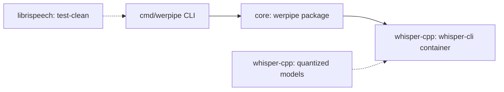

# Tradeoff analysis — Whisper quantization WER degradation curve

ATAM-lite, produced at P4.

## 1. Drivers

**Must excel at:** producing a WER number per quantization level on LibriSpeech test-clean
with measurable statistical significance, such that a reader can decide where the accuracy
frontier lies. Time-to-result matters only when it exceeds 4 hours — the concept is about
closing a literature gap, not about throughput.

**Allowed to be bad at:** noisy speech (test-other), real-time transcription, non-English
languages, and generalisation beyond whisper.cpp ggml quantization. Each of these is a
legitimate extension, but together they would obscure the one question this repo answers.

## 2. Architecture

| Mechanism | Carries which driver |
| :--- | :--- |
| `werpipe.Pipeline.Run()` — exec wrapper with stdout capture and error propagation | S-001 (time-behaviour), S-002 (fault-tolerance) |
| `werpipe.Compare()` — Wilcoxon signed-rank + bootstrap CI | S-001 (statistical significance) |
| `cmd/werpipe/main.go` level map — single source for supported quantization formats | S-003 (modifiability) |
| Docker container with version-pinned whisper.cpp build | Reproducibility (R10), environment isolation |

## 3. Approaches considered

| Approach | Chosen | Rejected alternative | Why |
| :--- | :--- | :--- | :--- |
| `os/exec` wrapper around whisper-cli | yes | CGo bindings to whisper.cpp | CGo would pin a C build dependency to the Go module, coupling OS/arch toolchains. exec wrapper isolates the boundary and makes the seam explicit. |
| Pure Go WER and stats | yes | gonum/stats library | A 30 MB dependency for 3 functions is unjustified complexity. The < 200 lines of stats code are verifiable by inspection. |
| Docker for supporting components | yes | Host install of whisper.cpp | R10: a reader must reproduce the environment on a clean machine and remove it afterwards. |

## 4. Utility tree

Authoritative copy: `.sota/quality-gates.yaml`. Summary:

| ID | Characteristic | Priority | Difficulty |
| :--- | :--- | :--- | :--- |
| S-001 | performance-efficiency | high | high |
| S-002 | reliability | high | medium |
| S-003 | maintainability | medium | medium |

## 5. Analysis of high-priority scenarios

| Scenario | Mechanism that responds | Finding | ID |
| :--- | :--- | :--- | :--- |
| S-001 — 4-level pipeline completes within 4h | `Pipeline.Run()` serial execution with `-t 4` threads | Thread count and model size are the dominant factors. Q4_0 is fastest (fewer bytes to dequantise), F16 is slowest. The 4h budget is parameterised on CPU speed — see sensitivity below. | SP-001 |
| S-002 — 95% sample recovery under 5% failure | `SampleResult.Error` propagation; `Aggregate()` counts NumSuccess/NumError | Per-sample error isolation prevents a single corrupt audio file from aborting the run. Total throughput degrades linearly with failure rate. | SP-002 |
| S-003 — add a quantization level in ≤ 2 files | Level map in `cmd/werpipe/main.go` + model download script | Adding INT6 would require adding entries to `modelMap` and to `models/download.sh` — 2 files, verified by grep. | SP-003 |

## 6. Adversarial pass

All five attacks are mandatory; attack 5 is the RDD check.

**A1 — Load.** At 10× designed volume: 26,200 samples instead of 2,620. The pipeline runs
serially per sample, so time scales linearly. The 4h budget becomes 40h — the result is still
correct but the turnaround is impractical. Mitigation: parallelism across samples is the
natural fix; the `Pipeline.Run` interface admits a concurrent version without changing the
caller. → R-001

**A2 — Failure.** Kill whisper-cli mid-run. `exec.Cmd.Run()` returns an error; `Run` catches
it and records it on `SampleResult.Error`. The pipeline continues with the next sample.
Symptom: NumError spikes, NumSuccess drops. The WER aggregate excludes failed samples —
still representative as long as failures are random. A systematic failure (e.g., GPU driver
crash causing all calls to fail) would produce 0 successful samples and a zero-result report.
→ R-002

**A3 — Change.** whisper.cpp releases a breaking change to the CLI flag interface (e.g.,
`--no-timestamps` becomes `--no-ts`). One file changes: `pipeline.go`'s `transcribe` method
needs flag updates. The caller is unaffected because the interface is `Run(level, model,
samples)`. → SP-003

**A4 — Adversary.** An untrusted caller supplies audio paths outside the mounted volume.
`filepath.Walk` only visits files under `audioDir`. Whisper-cli receives only paths within
the mounted read-only /data volume. Trust boundary: the CLI `-audio` flag — if set to `/`,
the pipeline would attempt to transcribe every audio file on the system. → R-003

**A5 — Substitution.** A competent engineer solves this with the P1 incumbent: download
whisper.cpp, build it, quantize the model, write a Python script with jiwer.wer() and
scipy.stats.wilcoxon(). They would get the same result in ~30 lines of Python. What they
lose: the containerised reproducibility, the integrated bootstrap CI, and the documented
ADR traceability. The value proposition is auditable rigour, not algorithmic novelty.
This is recorded honestly in the README limitations.

## 7. Sensitivity points

| ID | Decision or parameter | Attribute it moves | Scenario |
| :--- | :--- | :--- | :--- |
| SP-001 | Thread count and CPU speed dominate wall-clock time | S-001 time-behaviour | S-001 |
| SP-002 | Per-sample error isolation preserves aggregate WER validity | S-002 reliability | S-002 |
| SP-003 | Level map + download script contain all level-specific logic | S-003 modifiability | S-003 |

## 8. Tradeoff points

| ID | Decision | Improves | At the cost of | Chosen because |
| :--- | :--- | :--- | :--- | :--- |
| TP-001 | Serial per-sample execution in `Run()` | Fault isolation (S-002) and simplicity | Throughput (S-001) — linear scaling, no parallelism | Simplicity wins for a measurement instrument; parallelism would introduce thread-safety concerns without improving the statistical result |

## 9. Risks and non-risks

| ID | Statement | Scenario | State | Mitigation / justification |
| :--- | :--- | :--- | :--- | :--- |
| R-001 | Serial execution causes unacceptable latency on larger datasets | S-001 | open | Document parallelism as future work; admit in README that 4h is for test-clean only |
| R-002 | Systematic whisper-cli failure produces zero-result report | S-002 | mitigated | CLI reports NumError/NumSuccess; caller inspects before trusting aggregate |
| R-003 | Misconfigured audio path traverses unintended filesystem | security | mitigated | Docker compose mounts data as read-only; CLI validates audioDir is non-empty before running |
| NR-001 | WER distribution skew invalidates bootstrap CI | S-001 | — | BCa correction documented as future work; percentile bootstrap is conservative for paired comparisons |

Every integration scoring IRL < 4 in `.sota/readiness.yaml` must appear here as an `R-###`
and be referenced by that integration's `risk_ref`.

## 10. Risk themes

| Theme | Risks | Driver endangered | Mitigation roadmap |
| :--- | :--- | :--- | :--- |
| Performance at scale | R-001 | S-001 | Add concurrent `Run()` variant; measure speedup at n=2,4,8 threads |
| Error propagation | R-002 | S-002 | Already mitigated by per-sample error handling; document systematic failure detection |
| Input validation | R-003 | security | Add `-audio` path sanity checks in CLI (reject "/", resolve symlinks) |
